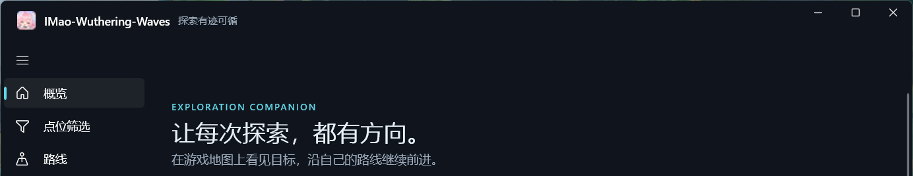
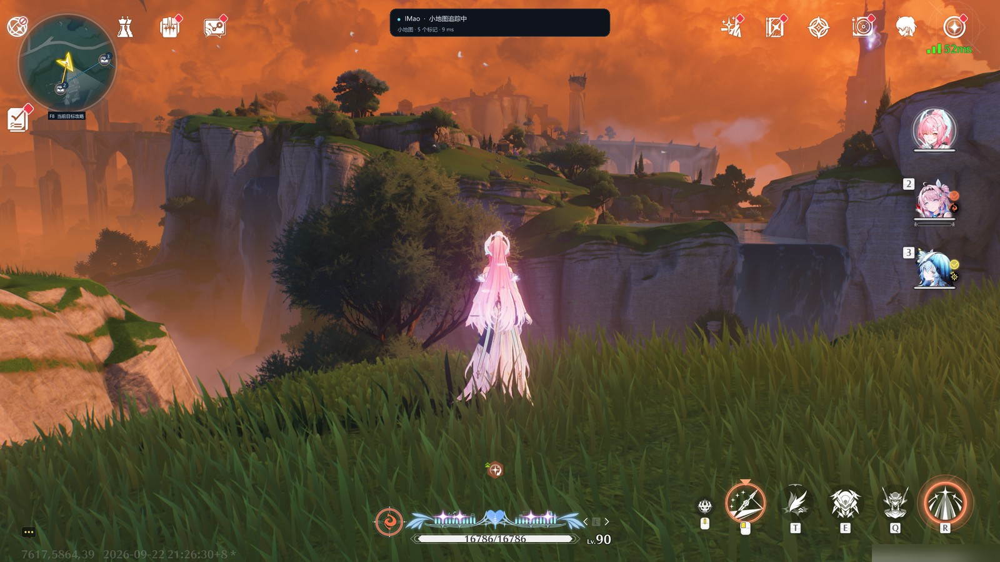
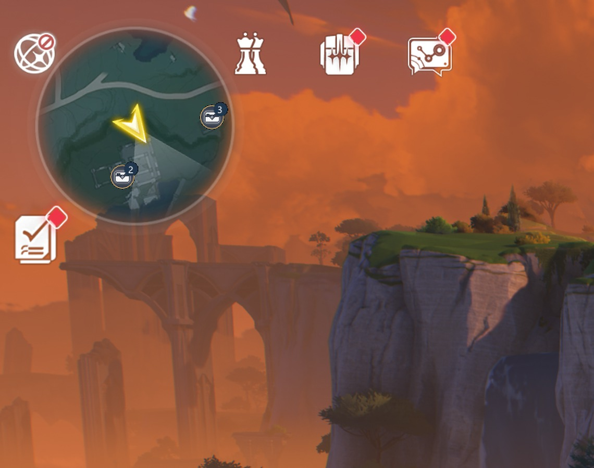
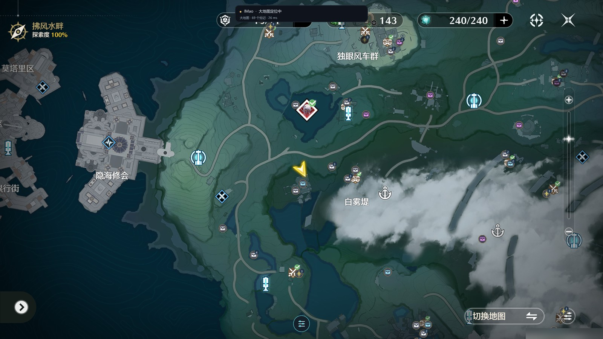
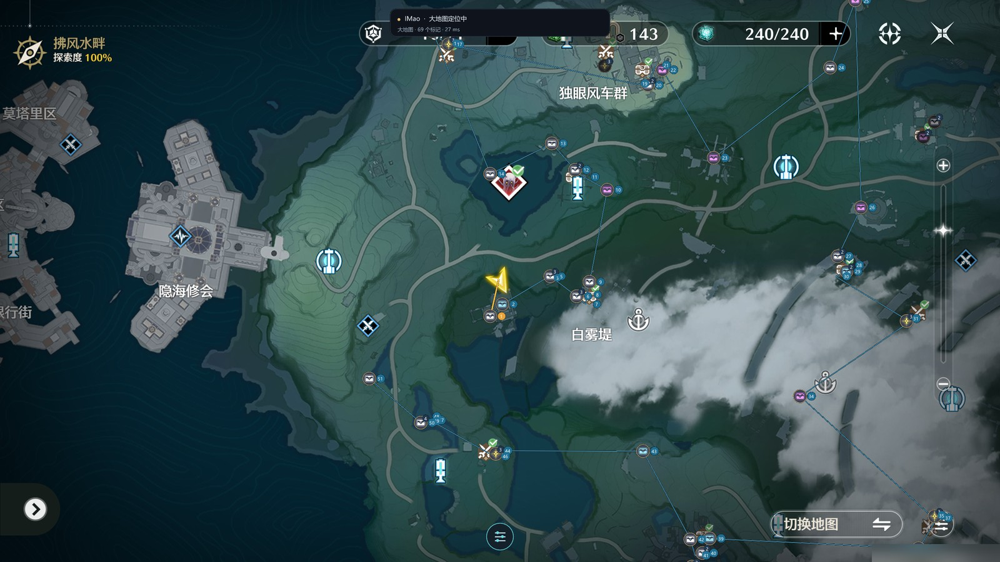
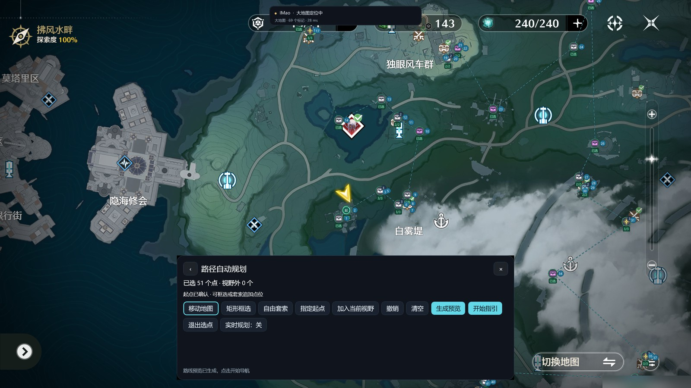

<!-- markdownlint-disable MD033 MD041 -->

# IMao · Wuthering Waves Map Tool

 

    
    

    
    
    

 

[简体中文](README.md) | [English](README.en.md)

**The KuroBBS interactive map, overlaid right on top of your game window.**

IMAO is a free and open-source unofficial community map tool for Wuthering Waves.

Markers, routes and collection progress are drawn inside the game, so you no longer
<kbd>Alt</kbd>+<kbd>Tab</kbd> back and forth while exploring.

Still actively updated ✿✿ヽ(°▽°)ノ✿

## Download & Install

Go to **[Releases](https://github.com/kahvia-d/IMAO/releases/latest)** and download
**`IMao-v<version>-windows-x64.zip`**, then unzip it and run **`IMao-Launcher.exe`**.

> In that list, anything starting with `ext-` is the **KuroBBS sync browser extension**, not the
> program. The program package is `IMao-v…-windows-x64.zip`.

### Download channels

- **[GitHub Releases](https://github.com/kahvia-d/IMAO/releases/latest)** is this project's official release page. Complete installation packages are free to download, and GitHub is also an in-app update source.
- **QQ group files** in the user group **`1109700733`** offer complete installation packages for free, primarily as a backup channel for users in mainland China. These packages are downloaded manually; the group is not an in-app automatic update source.
- **[MirrorChyan](https://mirrorchyan.com/zh/projects?rid=IMAO&source=imao_app_settings)** is an optional third-party high-speed download and update service that requires a MirrorChyan CDK. It is also an optional in-app update source.

IMAO itself is permanently free, with no paid edition, membership tier or feature unlocks. MirrorChyan charges for network distribution and update services and **does not unlock any additional IMAO features**. Using IMAO without MirrorChyan does not affect its normal functionality; you can still get the software free from GitHub Releases or QQ group files.

| Item | Requirement |
| :--- | :--- |
| OS | Windows 10 1809 (17763) or newer, **x64 only** |
| Game display | Any client aspect ratio (16:9 / 16:10 / 21:9); coordinate OCR is placed by the game's own HUD scale instead of a resolution list |
| Runtime | **No .NET installation needed** (the launcher is self-contained); the VC++ runtime ships with the package |
| Disk | About **1.5 GB** after extracting the full package (all map regions included) |

> Updates are small: **Settings → Check for updates** downloads only the shards that differ from your
> build — roughly 1.6 MB for a marker-data-only update, about 30 MB for a regular program update.
> You never re-download the whole package.

## Highlights

- **Real-time position sync.** Minimap feature matching is the primary source, backed by OCR of the
  in-game coordinate readout and big-map viewport solving. When tracking briefly drops, markers keep
  moving along the extrapolated path (about 7 units of error after one second).
- **Interactive big map and minimap navigation.** The overlay is drawn straight onto the game window:
  marker icons, count badges, overlap expansion, completed-marker display and **marker filtering** —
  the main window and the in-game tool palette share one filter state.
- **Automatic route planning.** Nearest-neighbour plus 2-opt local search, up to **500 targets per route**;
  measured P95 around **13.7 ms** at the 500-target scale. Preview, save, load, and **re-plan the
  remaining route live** while you walk.
- **One-key nearby collection.** Triggered within 15 minimap pixels by default (adjustable 5–120).
  A candidate list only appears when marker icons actually overlap; you can work through it
  continuously or collect a whole group at once.
- **Guide popup.** Marker details, illustrated guides, paging and zooming, with a separate always-on-top
  window for full-size images. Guides are cached online and **reading public guides requires no login**.
- **Automatic layered-map detection.** Inside caves and underground structures only your current floor's
  markers are shown; other floors appear dimmed with an up/down badge and surface markers hide
  themselves, then come back the moment you step out. Covers **57 layered maps / 90 floors**.
- **Per-region downloads.** Every region is a separate feature pack. Disable it, or delete the local copy
  to free disk space and download it again later. Offline import
  (`resources-<version>-offline.zip`) is supported too.
- **Xbox / PlayStation gamepad support.** Open the tool palette, the marker assistant, complete nearby markers,
  collect a whole group and zoom guide images — all without touching the keyboard.
- **KuroBBS progress sync.** With the [companion browser extension](https://microsoftedge.microsoft.com/addons/detail/ohmikfaeobbffhlhoocklplniobcfdbg),
  local records and your own KuroBBS account sync both ways: the initial merge takes the union, while later syncs also reflect user cancellations.
- **A signed update chain.** Manifests are ECDSA P-256 signed, every package is SHA-256 verified and
  executables are rejected inside map packages. Updates only touch the program and map data —
  your completion records, routes, filters and personal settings are **never overwritten**.
- **A choice of download source.** Settings → "Download source" offers **GitHub** (free, but often unreachable
  from mainland China) or
  [MirrorChyan](https://mirrorchyan.com/zh/projects?rid=IMAO&source=imao_app_settings) (an optional third-party high-speed download and update service
  requiring a MirrorChyan CDK, with no additional feature unlocks). The choice decides **both the update check and the download**.

<!-- markdownlint-disable -->

<b>Screenshots</b> (click to expand, 5 images)

 

**Minimap navigation** — markers sit on the minimap while you explore, together with routes and count badges.

**Minimap detail** — overlapping icons show a count badge; a hotkey collects the nearest one in range.

**Interactive big map** — aligned with the in-game map; left click opens a guide, right click toggles completion.

**Route guidance** — after planning, targets are ordered and the next stop switches automatically.

**Automatic route planning** — rectangle select, free lasso or add what is on screen, then start guiding.

<!-- markdownlint-restore -->

## Usage

### Quick start

1. Unzip the downloaded package and run `IMao-Launcher.exe`.
2. Launch Wuthering Waves (any client aspect ratio: 16:9, 16:10 or 21:9), and make sure the
   **coordinate readout in the lower-left corner is clearly visible** — it is one of the tool's
   positioning sources.
3. Click **Start exploring** and wait for the status message in the lower-right corner to disappear;
   that means positioning succeeded.
4. **On a cold start, open the in-game big map once** so the tool can determine which region you are in.
   Until then the status bar says "open the big map once to determine your region". After that, region
   detection is automatic wherever you go.
5. Open Settings to enable minimap/big-map markers and the status bar, or download the regions you want.

### Default hotkeys

Every binding can be changed, disabled or reset in **Settings → Keyboard shortcuts**, and takes effect
immediately.

| Key | Action |
| :--- | :--- |
| <kbd>Z</kbd> | Complete the nearby marker (a candidate list appears first if icons overlap) |
| <kbd>F8</kbd> | Open / close the guide for the current target |
| <kbd>Q</kbd> | Record the two endpoints of a hand-drawn route on the big map |
| <kbd>PageUp</kbd> / <kbd>PageDown</kbd> | Previous / next guide image |
| <kbd>F9</kbd> | Start / stop exploring (same as the button on the home page) |
| <kbd>Shift</kbd> + left-drag | Temporary rectangle selection while picking route targets |
| <kbd>Esc</kbd> | Cancel the current gesture, otherwise go back to panning the map |

> <kbd>M</kbd>, <kbd>F10</kbd> and <kbd>Esc</kbd> are reserved and cannot be bound.
> <kbd>Ctrl</kbd>/<kbd>Alt</kbd>/<kbd>Shift</kbd>/<kbd>Win</kbd> combinations do not trigger these actions.

### Gamepad

Enable it first in **Settings → Xbox / PlayStation gamepad** (off by default), then choose a device
and the Auto / Xbox / PlayStation button layout. Xbox and native DualShock 4 / DualSense USB and
Bluetooth basic input are supported. Native PS input has automated and virtual-device coverage;
physical USB / Bluetooth testing is still pending. Please include the device name and connection type in feedback.
For Steam Input / DS4Windows devices exposed as Xbox input, choose PlayStation hints manually.
The tool does **not** capture gamepad input, so the game's own action may fire at the same time.

Buttons correspond by position: A / B / X / Y = × / ○ / □ / △, LB / RB = L1 / R1,
LT / RT = L2 / R2, LS / RS = L3 / R3, Start / Back = Options / Share (Create on DualSense).

| Context | Xbox | PlayStation | Action |
| :--- | :--- | :--- | :--- |
| In-game big map | LB | L1 | Open the map tool palette |
| In-game big map | RB | R1 | Open the marker assistant |
| Exploring | Hold LB, then press B | Hold L1, then press ○ | Complete a nearby marker after releasing the chord; choose first if several |
| Exploring | Hold LB, then press X | Hold L1, then press □ | Open the nearby marker guide |
| Anywhere | LB + Start | L1 + Options | Start / stop exploring |
| Menus / lists | Left stick / D-pad, A, B | Left stick / D-pad, ×, ○ | Select, confirm, go back |
| Assistant details | Hold A for 0.6 s | Hold × for 0.6 s | Complete the selected marker; X / □ expands the image |
| Eligible candidate list | Hold X for 0.6 s | Hold □ for 0.6 s | Collect the whole group |
| Standalone guide | LS | L3 | Switch focus between game and guide |
| Standalone guide | B | ○ | Return focus to the game while keeping the guide visible |
| Standalone guide | LB + X | L1 + □ | Close the guide |
| Standalone guide details | Hold A for 0.6 s | Hold × for 0.6 s | Complete the current marker |
| Current route target guide | Hold Y for 0.6 s | Hold △ for 0.6 s | Skip this route target without changing marker completion |
| Guide image | LB / RB, X, right stick | L1 / R1, □, right stick | Previous / next image, expand image, scroll / pan |
| Expanded guide image | LT / RT | L2 / R2 | Zoom out / in |

Opening a standalone guide keeps the game focused; press LS / L3 to control it. Assistant details
receive focus directly. Only the selected
device is processed. Disconnecting never hands control to another controller. Release all buttons
and centre the sticks after reconnecting, switching devices or returning focus. USB and Bluetooth
may appear as different devices, so select the device again after changing connection type.

### KuroBBS progress sync extension

The tool can **sync progress both ways** with your [KuroBBS map](https://www.kurobbs.com/mc/map/) account.
The initial merge takes the union of completed markers. Local completions the cloud has never recorded
are kept and uploaded. Later, if you cancel a cloud completion recorded in the sync baseline, that
cancellation is reflected locally. With automatic sync enabled, local completion and cancellation
changes are also uploaded to your own KuroBBS account.

IMAO does not modify or fabricate public KuroBBS maps, markers or other shared content. Account progress
sync only takes place after you actively sign in to and connect your own KuroBBS account, using your own
login session to synchronise only your own marker completion status.

**Edge Add-ons (recommended): [IMao KuroBBS Progress Sync](https://microsoftedge.microsoft.com/addons/detail/ohmikfaeobbffhlhoocklplniobcfdbg)**

On Chrome, load the same code by hand with the [manual install guide](Docs/KuroMapSyncInstall.md) —
`manifest.json` pins the release public key, so the unpacked build gets exactly the same extension id
as the store build (`ohmikf…`) and the desktop credentials and sync profiles carry over unchanged.

Once installed:

1. In the tool, open **Settings → KuroBBS marker progress sync** and click "Register/repair browser bridge".
2. Open and sign in to the KuroBBS map, click the extension icon, then "Connect desktop app".
3. Back in the tool, "Preview sync" to see the difference, then "Apply sync". With automatic sync on,
   local completion or cancellation changes are pushed immediately and everything is reconciled every 10 minutes.

Credentials travel only over the browser's official Native Messaging channel to the local program, which
stores them encrypted with **DPAPI** under the current Windows user. The extension **does not read
cookies, does not touch other sites and makes no network requests of its own** — it only reads the
session the KuroBBS map page already holds.

### Supported regions

**14 regions, 52 sub-regions**. Regions are grouped by country in
Settings and can be disabled, deleted and re-downloaded (**changes apply after a full restart**).

**Mengshu Tianluo (梦枢天罗) is open and supported**, an independent sub-world
under Huanglong (Kuro state 912). Its marker data, region metadata, icons,
visual localisation features, calibration data and upstream imagery coverage/hash records are in the repository.
Its regional visual feature pack was generated from measured upstream imagery coverage and passes its
in-game minimap reference check (2.7 px); original map imagery is not committed.
Its four-point calibration was fitted from four in-game captures on 2026-09-30 (0.53 px
maximum error). It has passed local in-game trial approval and supports filters, marker labels and
visual localisation; the full four-check verification and baseline regression are still ongoing.
See [the calibration samples guide](Docs/KuroSceneCalibrationSamples.md).

| Country | Regions |
| :--- | :--- |
| Huanglong (瑝珑) | Jinzhou (今州), Mengzhou (梦州), Mengshu Tianluo (梦枢天罗) |
| Black Shores (黑海岸) | Black Shores Archipelago (黑海岸群岛), Tethys' Deep (泰缇斯之底), Time Rift Ruins (时隙废都) |
| Rinascita (黎那汐塔) | Ragunna (拉古那), Septimont (七丘), Lower Vault (下层金库), Avinoleum (阿维纽林), Fabricatorium (隐海试验场) |
| Roy's Icefield (罗伊冰原) | Icefield Surface (冰原地表), Lahai-Roi (拉海洛), Darkplain (黯原) |

Current regional visual localisation resource packs occupy about 3.3 MiB (Time Rift Ruins) to 270 MiB
(Lahai-Roi) on disk, including floor features. These are final visual resource sizes, not upstream imagery
sizes or compressed download sizes. Regions bundled with the program need no separate download.
Mengshu Tianluo's upstream imagery was confirmed at 12 tile positions and used to generate and validate
localisation features; those original PNGs are not distributed with the program.

### FAQ and known limits

<b>Click to expand</b>

 

- **Why open the big map once on a cold start?**
  A region's identity can only be established by visual matching or by the first big-map solve; the
  in-game coordinate readout alone cannot decide which region you are in. It is a one-time step.
- **Why do markers disappear when tracking is lost?**
  When positioning data is unavailable, ambiguous or insufficient, the last trusted position is kept for
  up to 3 seconds while markers move along the extrapolated path. After 2 seconds without a new result
  markers stop being drawn, so they never sit in place and flicker.
- **Some places cannot be located from the minimap.**
  Dark, fine-contour art styles, large water surfaces and sparse reefs (parts of Chengxiao Mountain and
  Tethys, for example) have too few features and matching is conservatively rejected there.
  **Opening the big map once solves it** — the in-game big map matches the imagery used to build localisation features, so it
  localises very reliably.
- **Does the game have to be 16:9?**
  No. The game scales its HUD by `min(width/1600, height/900)` and anchors each widget to the screen
  edge it hugs; the tool now places every crop by the same rule, so 2560×1600, 3840×2160 and 21:9
  clients all work and coordinate OCR is no longer limited to three 16:9 tiers.
  (Before 2026-09-26 a client that was not 1600×900 / 1920×1080 / 2560×1440 refused coordinate
  recognition, and on 16:10 the minimap crop sat too low while the task-icon box missed by 36px.)
- **What if two floors look almost identical?**
  The program treats them all as the current location instead of guessing one and mislabelling it as
  upstairs or downstairs.
- **When will new regions be available?**
  A new region needs four-point calibration, its own visual localisation feature pack and in-game validation.
  Lower Vault, Darkplain and Time Rift Ruins are calibrated from local captures and usable today, while
  the full four-check verification and the 113-sample regression are still outstanding. Mengshu Tianluo
  (archived 2026-09-30) has its regional feature pack and calibration in place and has passed local in-game
  trial approval, so it is usable; the full four-check verification and baseline regression are still ongoing.
- **Does it cost frame rate?**
  The overlay only paints the minimap and status-bar area (about **3.3%** of a 2560×1440 screen), and
  screen capture is limited to the regions exploration needs — measured capture cost dropped from about
  13 ms to about 6 ms. If display or frame rate looks wrong, switch the overlay presentation mode or
  adjust the refresh interval in Settings.
- **Is it safe for my account?**
  IMAO's positioning and overlays use **visible game-screen capture, image feature matching and coordinate
  recognition**. It does not read or modify game process memory, inject code or send automated gameplay
  input. Route planning and completion marking do not perform automatic navigation, combat or collection
  in the game. It cannot guarantee how third-party anti-cheat systems judge the tool — please assess this before using it.

### Update fails: "更新地址必须来自本项目的 GitHub Releases"

**Every build made before 2026-09-24 (including 2026.9.21.1 and 2026.9.23.1) is stuck here.** The project
repository was renamed, and those builds hard-coded the old repository path into their update check.
GitHub answers the old path with a `301` to the new one, the old updater rejects the redirect target, and
so **every download of an update fails** — checking for updates still shows the new release notes, but the
moment it tries to download it errors out. This is a defect in the program, not your network.

**What to do (a one-time fix, in order):**

1. Go to **[Releases](https://github.com/kahvia-d/IMAO/releases/latest)** and download
   **`IMao-v<version>-windows-x64.zip`** by hand.
2. **Exit IMao completely** (including the tray icon).
3. Unzip it into a **new folder** and run `IMao-Launcher.exe` from there to make sure it starts.
4. Once you are happy, replace your old install folder with the new one (or just keep using the new folder).

> **Nothing is lost**: marker completion records, routes, filters and personal settings live under
> `%LOCALAPPDATA%\IMao-WinUI`, **not in the program folder**, so replacing the program files does not touch
> them. After this one swap, automatic updates work again and you will not have to do it by hand.

## Development

To build it yourself or contribute:

- [Reproducible build (Windows x64)](Docs/Build_zh-Hans.md)
- [Compile with CMake](Docs/Compile_en.md) / [CMake 编译说明](Docs/Compile_zh-Hans.md)
- [Documentation index](Docs/README.md) (build, updates, map data, UI, audit records)
- Layout: `IMao-Core/` (C++ native core: visual localisation, resource loading, IPC),
  `IMao-WinUI/` + `IMao-WinUI.Core/` (WinUI 3 shell: UI, updates, settings),
  `tools/UpdatePublisher/` + `scripts/` (signed manifests and the release pipeline),
  `BrowserExtensions/KuroMapSync/` (KuroBBS sync extension).

This project continues the work of
[IMao-Wuthering-Waves](https://github.com/Yepin2022/IMao-Wuthering-Waves).

## Credits

### Open-source libraries

- Image recognition: [OpenCV](https://github.com/opencv/opencv) (with opencv_contrib, using SURF)
- Text recognition: [PaddleOCR](https://github.com/PaddlePaddle/PaddleOCR) / [Paddle Inference](https://www.paddlepaddle.org.cn/inference/master/guides/install/download_lib.html)
- Window capture: [Win32CaptureSample](https://github.com/robmikh/Win32CaptureSample)
- Overlay UI: [ImGui](https://github.com/ocornut/imgui)
- C++ JSON: [nlohmann/json](https://github.com/nlohmann/json)
- WinUI components: [CommunityToolkit/Windows](https://github.com/CommunityToolkit/Windows),
  [microsoft-ui-xaml](https://github.com/microsoft/microsoft-ui-xaml), [WinUIEx](https://github.com/dongle-the-gadget/WinUIEx)

### Data and localisation resource sources

- **Markers, categories and related map information:** from publicly accessible [KuroBBS Wuthering Waves map data](https://www.kurobbs.com/mc/map/).
- **Visual localisation features:** build tools read publicly accessible 1024×1024 KuroBBS map imagery, convert it to greyscale, extract SURF keypoints and descriptors, and transform them into IMAO's map/world coordinates to generate localisation resources.
- **Original map imagery:** build-time input only, archived in local directories such as `map-regions/tiles/...`. Original tiles and layered imagery are excluded by `.gitignore`; only manifest/hash records are committed. **Original map tiles are not included in the repository or release packages.**
- **In-game validation references:** some regional feature packs include `reference-minimap.png` screenshots captured by maintainers from visible gameplay, solely for localisation calibration and validation. These are not original KuroBBS map tiles.

Build pipeline: `publicly accessible map imagery → greyscale → SURF feature extraction → coordinate conversion → IMF feature data → IMX visual index`.
Regional localisation resources in release packages (internally named `KuroTilePacks`) primarily contain
keypoints, descriptors, spatial coordinates, `.imf` feature data, `.imx` visual search/index data and
manifests — **not original KuroBBS map imagery**.

The map-data and visual localisation build workflows use data and map resources normally made publicly
accessible to ordinary KuroBBS map web users. They do not rely on cracking, decryption or bypassing
authentication, paywalls or technical access controls to obtain these resources; public accessibility
does not automatically grant permission to use them.

Thanks to everyone who developed, tested and reported issues — you are what makes this tool better! (\*´▽｀)ノノ

## Star History

<a href="https://www.star-history.com/?repos=kahvia-d%2FIMAO&amp;type=date&amp;legend=top-left">
  <picture>
    <source media="(prefers-color-scheme: dark)" srcset="https://api.star-history.com/chart?repos=kahvia-d/IMAO&amp;type=date&amp;theme=dark&amp;legend=top-left" />
    <source media="(prefers-color-scheme: light)" srcset="https://api.star-history.com/chart?repos=kahvia-d/IMAO&amp;type=date&amp;legend=top-left" />
    
  </picture>
</a>

## Community

**User QQ group: `1109700733`**

Bugs, feature requests, or just somewhere to talk about Wuthering Waves — you are welcome to join.
You can also file an [issue](https://github.com/kahvia-d/IMAO/issues).

If this tool helped you, **please give it a Star** — it is the biggest support you can give us!

## Disclaimer

- IMAO is a free and open-source unofficial community map tool for Wuthering Waves. Its software code is provided under the [GNU General Public License v3.0](LICENSE), with no additional restrictions on its uses.
- GPL-3.0 applies to software code and project-owned content that this project has the right to license. Names, trademarks, images, icons, guides and other materials involving Wuthering Waves, KuroBBS or other third parties remain subject to the rights of their respective rights holders or content authors.
- IMAO is not affiliated with, authorised, sponsored, or endorsed by Kuro Games or KuroBBS. Rights to Wuthering Waves, KuroBBS, related names, trademarks, maps, images, icons, game assets and other third-party content belong to their respective rights holders.
- Markers, categories and related map information come from publicly accessible [KuroBBS Wuthering Waves map data](https://www.kurobbs.com/mc/map/). Build tools extract SURF features from publicly accessible map imagery, convert their coordinates and generate visual indices to produce localisation resources.
- **Original KuroBBS map tiles are not included in the Git repository or release packages.** Distributed regional localisation resources contain machine-vision features and index data, not original map imagery; the few in-game minimap reference screenshots are solely for localisation calibration and validation.
- IMAO does not modify or fabricate public KuroBBS maps, markers or other shared content. Account progress sync only takes place after users actively sign in to and connect their own KuroBBS accounts, using their own login sessions to synchronise their own marker completion status.
- Game positioning and overlays use visible-screen capture, image feature matching and coordinate recognition. IMAO does not read or modify game process memory, inject code, send automated gameplay input or perform automatic navigation, combat or collection in the game.
- IMAO itself is permanently free, with no paid edition, membership tier or feature unlocks. GitHub Releases and QQ group files both provide free access. MirrorChyan is only an optional third-party high-speed download and update service requiring a MirrorChyan CDK; it unlocks no additional IMAO features, and not using it does not affect normal functionality.
- This project cannot guarantee how third-party platforms or anti-cheat systems will judge the tool; please assess this yourself before using it. Rights holders or content authors with concerns about a specific item's source, attribution or use are welcome to contact the maintainers through [GitHub Issues](https://github.com/kahvia-d/IMAO/issues). We will review the specific content and correct it, add attribution, adjust it or remove it as appropriate.
