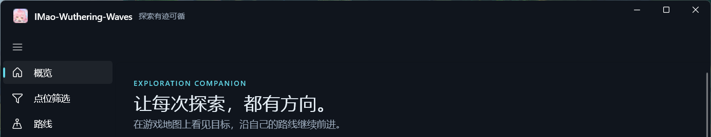
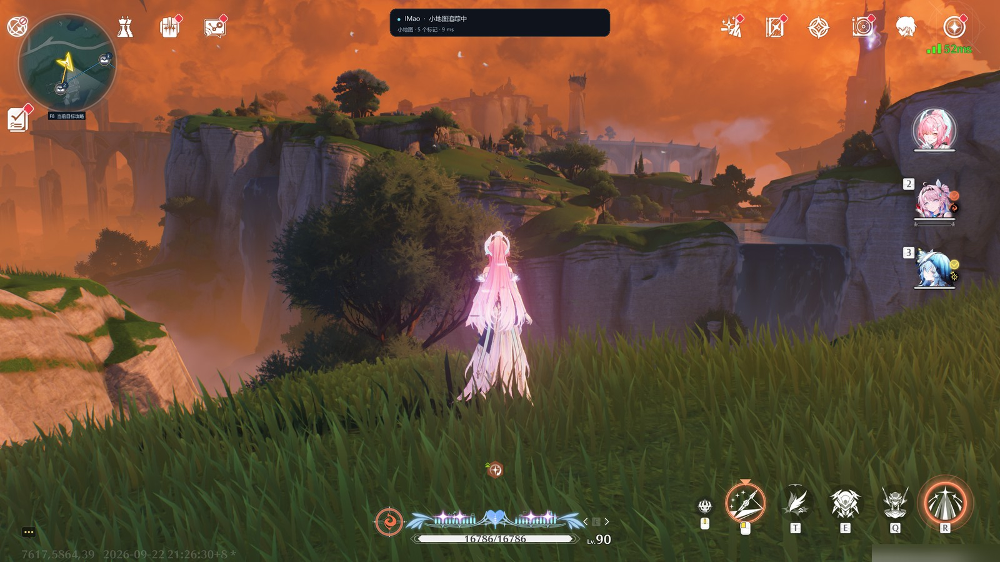
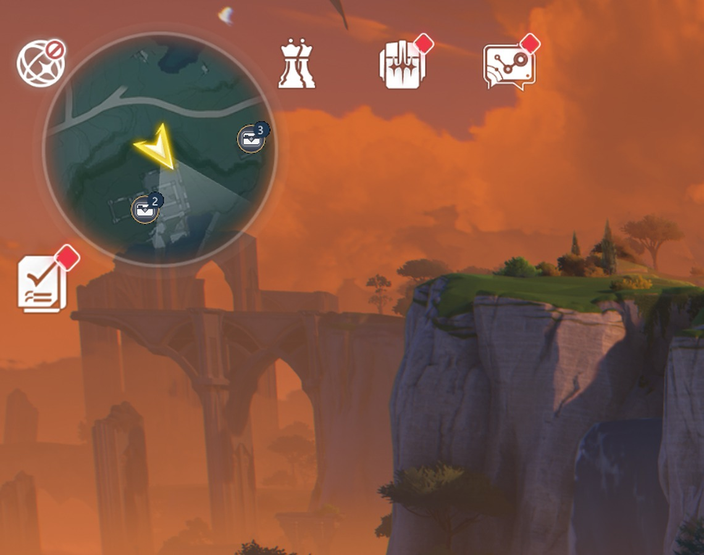
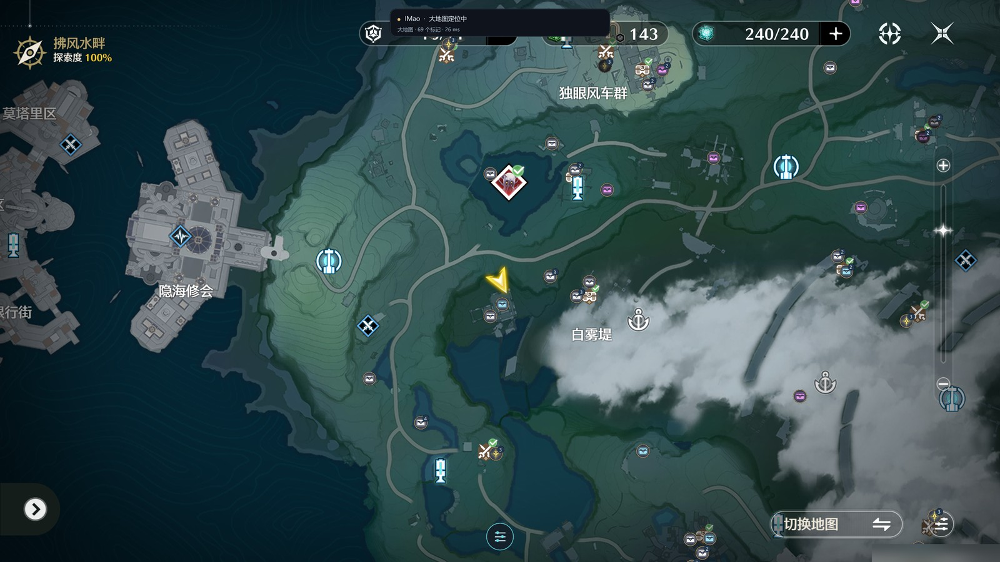
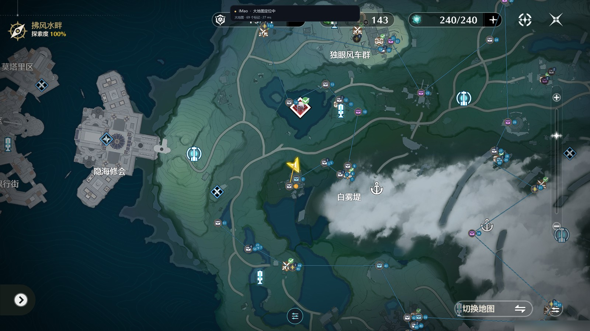
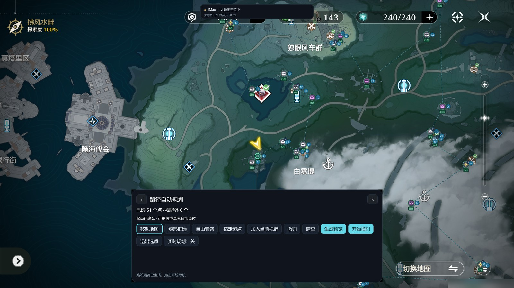

<!-- markdownlint-disable MD033 MD041 -->

# IMao · 鸣潮地图工具

 

    
    

    
    
    

 

[简体中文](README.md) | [English](README.en.md)

**把库街区大地图直接叠在游戏窗口上。**

点位、路线、收集进度都画在游戏画面里，探索时不必再反复按 <kbd>Alt</kbd>+<kbd>Tab</kbd> 切来切去。

绝赞更新中 ✿✿ヽ(°▽°)ノ✿

## 下载与安装

前往 **[Releases](https://github.com/kahvia-d/WWMAP-TOOLS/releases/latest)** 下载 `IMao-v<版本号>-windows-x64.zip`，
解压后运行 **`IMao-Launcher.exe`** 即可。

| 项目 | 要求 |
| :--- | :--- |
| 系统 | Windows 10 1809（17763）或更高，**仅支持 x64** |
| 游戏画面 | 必须为 **16:9**；坐标识别支持 1600×900 / 1920×1080 / 2560×1440 |
| 运行库 | **无需安装 .NET**（启动器自包含）；VC++ 运行库随包附带 |
| 磁盘 | 完整包解压后约 **1.5 GB**（已含全部地区地图资源） |

> 更新也很快：程序内「设置 → 检查更新」只会下载**与本机不一致的分片**，只改点位时通常在 1.6 MB 左右，
> 常规程序更新约 30 MB，不需要每次重下整个包。

## 亮点功能

- **实时同步位置**：小地图特征匹配为主，辅以游戏左下角坐标识别与大地图视口解算，把玩家位置实时画在地图上；
  短暂跟丢时按轨迹外推继续移动（外推 1 秒误差约 7 个单位）。
- **交互式大地图 / 小地图导航**：覆盖层直接画在游戏画面上，支持点位图标、数量角标、重叠点位展开、
  已完成点显示与**点位筛选**，主界面与游戏内工具台共用同一份筛选状态。
- **自动路线规划**：按平面距离做最近邻 + 2-opt 局部搜索，单条路线最多 **500 个目标**；
  实测 500 点规模下求解 P95 约 **13.7 ms**，站定不动时也不会卡。支持预览、保存、载入与**实时重排剩余路线**。
- **附近点位一键收集**：默认按小地图 15 像素范围（5–120 可调）判定，只有图标相互遮挡时才列出候选；
  候选列表可连续处理，也能「一键收集本组全部点位」。
- **攻略浮窗**：点位详情、图文攻略、翻页与缩放，大图为独立置顶窗口；攻略内容在线缓存，**查看公开攻略无需登录**。
- **分层地图自动识别**：进入洞穴、地下建筑后自动只显示所在楼层点位，其它楼层以暗色图标加「上／下」角标区分，
  地表点位自动隐藏；走出分层区域立即恢复。目前覆盖 **57 个分层地图、90 个楼层**。
- **地区按需下载**：每个地区是一份独立的特征包，用不到的地区可以停用或直接从磁盘删除腾空间，
  之后随时再点「下载」取回。支持**导入离线包**（`resources-<版本>-offline.zip`）。
- **Xbox 手柄支持**：打开工具台、点位助手、完成附近点位、一键收集、缩放攻略图，都可以不碰键盘。
- **库街区进度同步**：配合浏览器扩展，把本机收集记录与库街区账号双向补齐（只做并集，不会取消任何点位）。
- **安全的更新链路**：清单经 ECDSA P-256 签名，逐包校验 SHA-256，禁止包内出现可执行文件；
  更新只动程序与地图资源，**绝不覆盖**你的完成记录、路线、筛选与个人设置。

<!-- markdownlint-disable -->

<b>功能演示</b>（点击展开，共 5 张）

 

**小地图导航** —— 探索时点位就在小地图上，路线与数量角标一并显示。

**小地图细节** —— 图标重叠时显示数量角标，快捷键可在范围内就近完成收集。

**交互式大地图** —— 与游戏大地图完全对位，左键看攻略、右键切换完成状态。

**路线指引** —— 规划完成后按顺序指引，靠近目标自动切换下一站。

**路径自动规划** —— 矩形框选 / 自由套索 / 加入当前视野，生成预览后一键开始指引。

<!-- markdownlint-restore -->

## 使用说明

### 快速开始

1. 解压下载的压缩包，运行 `IMao-Launcher.exe`。
2. 打开鸣潮，把游戏画面设为 **16:9**，并让**左下角的坐标读数清晰显示**（这是工具的定位来源之一）。
3. 回到工具点「开始探索」，等右下角的状态提示消失，说明已成功定位。
4. **冷启动时请先打开一次游戏大地图**，让工具确定你所在的区域；在此之前状态栏会提示
   「请打开一次大地图以确定所在区域」。之后进出任何地区都会自动识别，不用再手动切换。
5. 打开设置页按需开启「小地图点位 / 大地图点位 / 状态条」，或先下载要用的地区资源。

### 默认快捷键

在**设置 → 键盘快捷键**里可以逐项修改、禁用或恢复默认，保存后立即生效。

| 按键 | 作用 |
| :--- | :--- |
| <kbd>Z</kbd> | 完成附近点位（范围内多个点位图标重叠时先弹出候选列表） |
| <kbd>F8</kbd> | 打开 / 关闭当前目标攻略 |
| <kbd>Q</kbd> | 在大地图上记录手绘路线的两个端点 |
| <kbd>PageUp</kbd> / <kbd>PageDown</kbd> | 攻略图上一张 / 下一张 |
| <kbd>F9</kbd> | 开始 / 停止探索（与首页按钮等价） |
| <kbd>Shift</kbd> + 左键拖动 | 自动路线选点时的临时矩形框选 |
| <kbd>Esc</kbd> | 取消当前手势，否则回到移动地图 |

> <kbd>M</kbd>、<kbd>F10</kbd>、<kbd>Esc</kbd> 为程序保留键，不可绑定；<kbd>Ctrl</kbd>/<kbd>Alt</kbd>/<kbd>Shift</kbd>/<kbd>Win</kbd>
> 组合键不会触发这些自定义操作。

### 手柄操作

需先在**设置 → Xbox 手柄**里开启（默认关闭）。工具**不拦截**游戏的手柄输入，因此同键的游戏原生动作可能同时触发。

| 场景 | 操作 | 作用 |
| :--- | :--- | :--- |
| 游戏大地图 | <kbd>LB</kbd> | 打开地图工具台 |
| 游戏大地图 | <kbd>RB</kbd> | 打开独立点位助手 |
| 探索中 | <kbd>LB</kbd> → <kbd>B</kbd> | 完成附近点位 |
| 探索中 | <kbd>LB</kbd> → <kbd>X</kbd> | 打开附近点位攻略 |
| 任意 | <kbd>LB</kbd> + <kbd>Start</kbd> | 开始 / 停止探索 |
| 点位详情 | 长按 <kbd>A</kbd> 0.6 秒 | 完成当前点位 |
| 候选列表 | 长按 <kbd>X</kbd> 0.6 秒 | 一键完成整组 |
| 攻略图 | <kbd>X</kbd> / <kbd>LT</kbd> / <kbd>RT</kbd> / 右摇杆 | 放大 / 缩小 / 放大 / 平移 |

### 支持的地区

共 **13 个地区、51 个子区域、约 23,800 个点位**（含 527 种图标）。地区可在设置页按国家分组查看，
支持停用、删除与重新下载（**改动需完全退出并重新打开软件后生效**）。

| 国家 | 地区 |
| :--- | :--- |
| 瑝珑 | 今州、梦州 |
| 黑海岸 | 黑海岸群岛、泰缇斯之底、时隙废都 |
| 黎那汐塔 | 拉古那、七丘、下层金库、阿维纽林、隐海试验场 |
| 罗伊冰原 | 冰原地表、拉海洛、黯原 |

单个地区包体积从约 3 MB（时隙废都）到约 211 MB（拉海洛）不等；随程序分发的地区不占额外下载量。

### 常见问题与已知限制

<b>点开看详细说明</b>

 

- **为什么冷启动要先开一次大地图？**
  区域身份只能由视觉匹配或大地图首次解算确定，游戏坐标读数不能单独决定「我在哪个区域」。
  这一步只需一次，之后进出地区都会自动识别。
- **定位丢失时标记为什么会消失？**
  任一定位数据不可用、结果有歧义或证据不足时，程序会保持上一可信位置最多 3 秒；期间按轨迹外推继续移动标记，
  超过 2 秒没有新结果就不再绘制，避免标记停在原地闪烁。
- **有些地方小地图定位不出来。**
  深色细等高线画风、大片水面与稀疏礁石区域（例如乘霄山、泰缇斯部分区域）特征太少，匹配会被保守拒绝。
  这类位置**打开一次大地图即可定位**——大地图渲染与工具使用的瓦片一致，识别非常稳定。
- **分辨率必须是 16:9 吗？**
  是。坐标识别目前只覆盖 1600×900 / 1920×1080 / 2560×1440；其它比例或分辨率会安全拒绝坐标识别，
  只靠视觉匹配工作。
- **少数楼层的画面高度相似时会怎样？**
  程序会把它们一并当作当前位置显示，而不是猜一个再标成楼上或楼下。
- **新区什么时候能用？**
  新地区需要完成四点校准 + 独立瓦片特征包 + 实机验证才会开放。下层金库、黯原、时隙废都已通过本机录制试校准
  并可用，完整的四项检查与 113 张基线回归仍在进行中。
- **会掉帧吗？**
  覆盖层默认只绘制小地图与状态条所需的区域（2560×1440 下小地图窗口约占 **3.3%** 屏幕面积），
  画面读取也只截取探索所需的若干区域，实测读取耗时由约 13 ms 降至约 6 ms。
  若显示或帧率异常，可在设置页切换「叠加层呈现方式」或调整刷新间隔。
- **会不会影响账号安全？**
  工具**只截取游戏的可见画面并做图像匹配**，**不读写游戏内存、不向游戏发送任何输入**。
  它不会、也无法保证第三方反作弊的判断，请自行评估后再使用。

## 开发

想自己编译或参与开发，请看：

- [可复现构建（Windows x64）](Docs/Build_zh-Hans.md)
- [CMake 编译说明](Docs/Compile_zh-Hans.md) / [Compile with CMake](Docs/Compile_en.md)
- [文档索引](Docs/README.md)（构建、更新、地图数据、界面、审计记录分类归档）
- 项目结构：`IMao-Core/`（C++ 原生核心：视觉定位、资源加载、IPC）、
  `IMao-WinUI/` + `IMao-WinUI.Core/`（WinUI 3 外壳：界面、更新、设置）、
  `tools/UpdatePublisher/` + `scripts/`（签名清单与发布链路）、`BrowserExtensions/KuroMapSync/`（库街区同步扩展）。

本项目基于 [IMao-Wuthering-Waves](https://github.com/Yepin2022/IMao-Wuthering-Waves) 持续修复与二次开发。

## 致谢

### 开源库

- 图像识别：[OpenCV](https://github.com/opencv/opencv)（含 opencv_contrib，使用 SURF）
- 文字识别：[PaddleOCR](https://github.com/PaddlePaddle/PaddleOCR) / [Paddle Inference](https://www.paddlepaddle.org.cn/inference/master/guides/install/download_lib.html)
- 窗口捕获：[Win32CaptureSample](https://github.com/robmikh/Win32CaptureSample)
- 覆盖层界面：[ImGui](https://github.com/ocornut/imgui)
- C++ JSON：[nlohmann/json](https://github.com/nlohmann/json)
- WinUI 组件：[CommunityToolkit/Windows](https://github.com/CommunityToolkit/Windows)、
  [microsoft-ui-xaml](https://github.com/microsoft/microsoft-ui-xaml)、[WinUIEx](https://github.com/dongle-the-gadget/WinUIEx)

### 数据来源

- 地图与点位数据：[库街区鸣潮大地图](https://www.kurobbs.com/mc/map/)
- 瓦片影像：库街区公开地图接口

感谢所有参与开发、测试与反馈的朋友们，是大家的帮助让这个工具越来越好！(\*´▽｀)ノノ

## 加入我们

**用户交流 QQ 群：`1109700733`**

遇到 Bug、想要新功能，或者只是想找个地方聊鸣潮，都欢迎进群；也欢迎到
[Issues](https://github.com/kahvia-d/WWMAP-TOOLS/issues) 反馈。

如果这个工具帮到了你，**帮忙点个 Star 吧**！~（网页右上角的小星星）这就是对我们最大的支持了！

## 声明

- 本软件使用 [GNU General Public License v3.0](LICENSE) 开源，**免费**提供。
- 本软件开源、免费，仅供学习交流使用。若您遇到商家使用本软件进行代练并收费，可能是设备与时间等费用，
  产生的问题及后果与本软件无关。
- 本软件与库洛游戏（Kuro Games）无关，未获其授权、赞助或背书；游戏素材与地图数据的权利归原权利人所有。
- 地图与点位数据来自库街区公开数据。分发或长期托管前，请自行持续遵守上游网站与游戏的适用条款。
- 使用本软件产生的任何后果由使用者自行承担。
